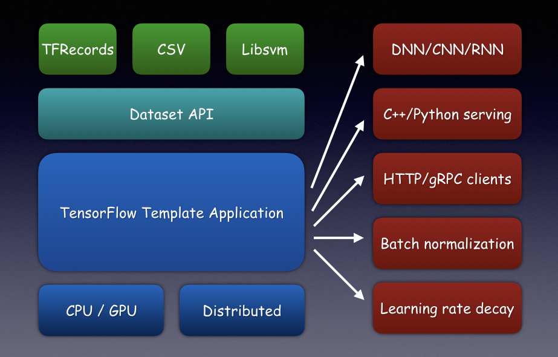

## Introduction

It is the generic golden program for deep learning with [TensorFlow](https://github.com/tensorflow/tensorflow).



- [x] Data Formats
  - [x] [CSV](./data/)
  - [x] [LIBSVM](./data/)
  - [x] [TFRecords](./data/)
- [x] Predict Server
  - [x] [TensorFlow serving](./cpp_predict_server/)
  - [x] [Python HTTP server](./http_service/)
- [x] Predict Client
  - [x] [Python gPRC client](./python_predict_client/)
  - [x] [Java gPRC client](./java_predict_client/)
  - [x] [Scala gPRC client](./java_predict_client/)
  - [x] [Golang gRPC client](./golang_predict_client/)
  - [x] [C++ gRPC client](./cpp_predict_client/)
  - [x] [Spark client](./java_predict_client/)
  - [x] [Android client](./android_client/)
  - [x] [iOS client](./ios_client/)
- [x] Network Models
  - [x] Logistic regression
  - [x] Deep neural network
  - [x] Convolution neural network
  - [x] Wide and deep model
  - [x] Regression model
  - [x] Customized models
- [x] Other Features
  - [x] Checkpoint
  - [x] TensorBoard
  - [x] Exporter
  - [x] Dropout
  - [x] Optimizers
  - [x] Learning rate decay
  - [x] Batch normalization
  - [x] Benchmark mode
  - [x] [Distributed training](./distributed/)

## Usage

### Generate TFRecords

If your data is in CSV format, generate TFRecords like this.

```
cd ./data/cancer/

./generate_csv_tfrecords.py
```

If your data is in LIBSVM format, generate TFRecords like this.

```
cd ./data/a8a/

./generate_libsvm_tfrecord.py
```

For large dataset, you can use Spark to do that. Please refer to [data](./data/).

### Run Training

You can train with the default configuration.

```
./dense_classifier.py

./sparse_classifier.py
```

Using different models or hyperparameters is easy with TensorFlow flags.

```
./dense_classifier.py --batch_size 1024 --epoch_number 1000 --step_to_validate 10 --optmizier adagrad --model dnn --model_network "128 32 8"
```

If you use other dataset like [iris](./data/iris/), no need to modify the code. Just run with parameters to specify the TFRecords files.

```
./dense_classifier.py --train_file ./data/iris/iris_train.csv.tfrecords --validate_file ./data/iris/iris_test.csv.tfrecords --feature_size 4 --label_size 3  --enable_colored_log

./dense_classifier.py --train_file ./data/iris/iris_train.csv --validate_file ./data/iris/iris_test.csv --feature_size 4 --label_size 3 --input_file_format csv --enable_colored_log
```

If you want to use CNN model, try this command.

```
./dense_classifier.py --train_file ./data/lung/fa7a21165ae152b13def786e6afc3edf.dcm.csv.tfrecords --validate_file ./data/lung/fa7a21165ae152b13def786e6afc3edf.dcm.csv.tfrecords --feature_size 262144 --label_size 2 --batch_size 2 --validate_batch_size 2 --epoch_number -1 --model cnn
```

For [boston housing](./data/boston_housing/) dataset.

```
./dense_classifier.py --train_file ./data/boston_housing/train.csv.tfrecords --validate_file ./data/boston_housing/train.csv.tfrecords --feature_size 13 --label_size 1 --scenario regression  --batch_size 1 --validate_batch_size 1
```

### Export The Model

After training, it will export the model automatically. Or you can export manually.

```
./dense_classifier.py --mode savedmodel
```

### Validate The Model

If we want to run inference to validate the model, you can run like this.

```
./dense_classifier.py --mode inference
```

### Use TensorBoard

The program will generate TensorFlow event files automatically.

```
tensorboard --logdir ./tensorboard/
```

Then go to `http://127.0.0.1:6006` in the browser.

### Serving and Predicting

The exported model is compatible with [TensorFlow Serving](https://github.com/tensorflow/serving). You can follow the document and run the `tensorflow_model_server`.

```
./tensorflow_model_server --port=9000 --model_name=dense --model_base_path=./model/
```

We have provided some gRPC clients for dense and sparse models, such as [Python predict client](./python_predict_client/) and [Java predict client](./java_predict_client/).

```
./predict_client.py --host 127.0.0.1 --port 9000 --model_name dense --model_version 1

mvn compile exec:java -Dexec.mainClass="com.tobe.DensePredictClient" -Dexec.args="127.0.0.1 9000 dense 1"
```

## Contribution

This project is widely used for different tasks with dense or sparse data.

If you want to make contirbutions, feel free to open an [issue](https://github.com/tobegit3hub/deep_recommend_system/issues) or [pull-request](https://github.com/tobegit3hub/deep_recommend_system/pulls).
